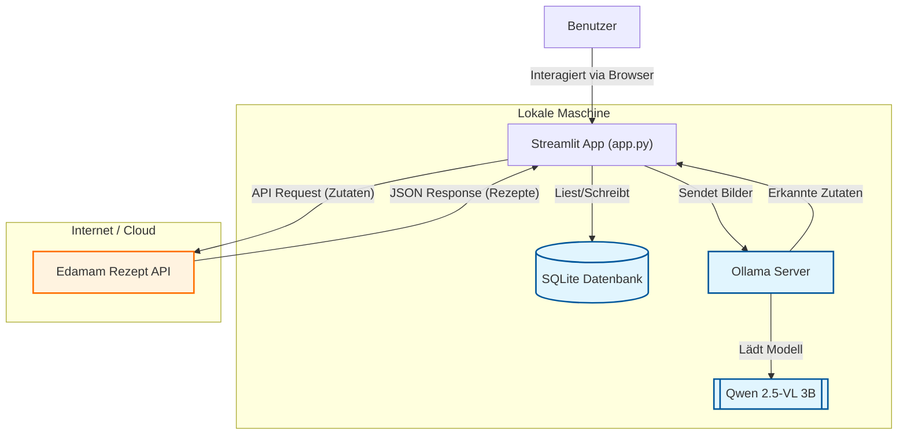

#  Kücheninventar & Rezept-Manager

Eine intelligente Anwendung zur Verwaltung von Zutaten und Entdeckung neuer Rezepte. Diese App nutzt **lokale KI (Ollama/Qwen)** zur Bilderkennung von Zutaten und die **Edamam API** zur Rezeptsuche.

##  Funktionen

*   **Benutzerverwaltung:** Sicheres Login und Registrierungssystem (gespeichert in SQLite).
*   **KI-gestützte Bildanalyse:** Laden Sie ein Foto Ihres Kühlschranks oder Ihrer Zutaten hoch. Das lokale KI-Modell (Qwen 2.5-VL) erkennt die Zutaten automatisch.
*   **Rezept-Suche:** Findet passende Rezepte basierend auf Ihren Zutaten (inkl. Kalorienangaben und Küchentyp).
*   **Favoriten:** Speichern Sie Ihre Lieblingsrezepte in Ihrem persönlichen Profil.
*   **Privatsphäre:** Die Bildanalyse läuft lokal auf Ihrem Rechner – keine Bilder werden an Google oder andere KI-Cloud-Dienste gesendet.

---

##  Systemarchitektur

Das folgende Diagramm zeigt, wie die Komponenten der Anwendung zusammenarbeiten:



---

##  Installation & Einrichtung

### 1. Voraussetzungen

*   **Python 3.8+** installiert.
*   **Ollama** installiert (für die lokale KI). [Download hier](https://ollama.com).
*   Ein **Edamam API Account** (Recipe Search API v2). [Hier registrieren](https://www.edamam.com/).

### 2. Repository klonen & Umgebung einrichten

```bash
# In das Projektverzeichnis wechseln
cd Kuecheninventar

# Virtuelle Umgebung erstellen (empfohlen)
python -m venv .venv

# Virtuelle Umgebung aktivieren
# Linux/Mac:
source .venv/bin/activate
# Windows:
# .venv\Scripts\activate

# Abhängigkeiten installieren
pip install -r requirements.txt
```

### 3. Ollama & KI-Modell einrichten

Stellen Sie sicher, dass Ollama läuft, und laden Sie das benötigte Vision-Modell herunter:

```bash
# Modell herunterladen (ca. 3GB)
ollama pull qwen2.5vl:3b
```

### 4. API-Keys konfigurieren

Erstellen Sie eine Datei namens `.env` im Hauptverzeichnis und fügen Sie Ihre Edamam-Zugangsdaten hinzu:

```ini
# .env Datei
EDAMAM_APP_ID=ihre_app_id_hier
EDAMAM_APP_KEY=ihr_app_key_hier
```

---

##  Bedienungsanleitung

Starten Sie die Anwendung mit folgendem Befehl:

```bash
streamlit run app.py
```

### Navigation durch die App

1.  **Login / Registrieren:**
    *   Beim ersten Start wählen Sie in der Sidebar "Registrieren".
    *   Erstellen Sie einen Benutzernamen und ein Passwort.
    *   Loggen Sie sich anschließend ein.

2.  **Tab 1: Suche & Entdecken:**
    *   **Bild-Upload:** Klicken Sie auf "Browse files" und laden Sie ein Bild Ihrer Zutaten hoch.
    *   Klicken Sie auf **"Zutaten erkennen"**. Die App nutzt Qwen (via Ollama), um das Bild zu analysieren.
    *   Sobald Zutaten erkannt wurden, startet die Rezeptsuche automatisch.
    *   Alternativ können Sie Zutaten auch manuell eingeben.
    *   Klicken Sie bei einem Rezept auf **"Speichern "**, um es zu merken.

3.  **Tab 2: Meine Gespeicherten Rezepte:**
    *   Hier sehen Sie alle Rezepte, die Sie gespeichert haben.
    *   Sie können Details (Kalorien, Zutatenliste) einsehen oder Rezepte löschen.

---

##  Technologien

*   **Frontend:** [Streamlit](https://streamlit.io/)
*   **Backend Logic:** Python
*   **Datenbank:** SQLAlchemy & SQLite
*   **Authentifizierung:** Bcrypt (Hashing)
*   **Vision AI:** [Ollama](https://ollama.com/) mit [Qwen 2.5-VL](https://huggingface.co/Qwen/Qwen2.5-VL-3B-Instruct)
*   **Rezept Daten:** [Edamam API](https://www.edamam.com/)